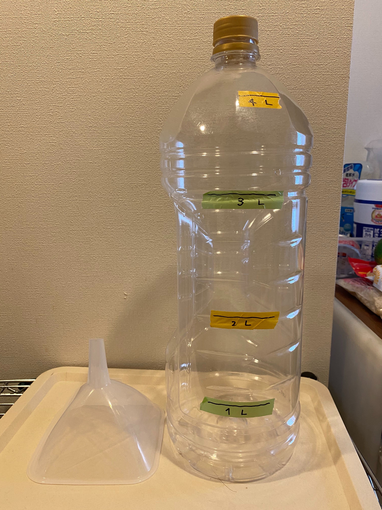

# さくらインターネット秘伝のおいしいタコ焼き(たなかレシピ)

## 最初に

このレシピはフリーです。
自由にブランチを切ったりして派生形をつくってもらってOKです

自由に作成してレポートを寄せてください。異常がありましたら issue等でお知らせください

## 材料の準備

### 材料・食材
以下の材料を準備してください
【約20～30人分(300個)】

```
＜たこ焼き 生地＞
・a 薄力粉               500g×3
・a 水                   6000g (500mlx12回)
・a 粉末だし             120g  (8gx15袋)
・a 卵                   20個
・b ベーキングパウダー   40g
```
```
＜その他(調理時に必要なもの)＞
・サラダ油             適量
・天かす(または揚げ玉) 250g 前後
・タコ                 1000g
   → 「カット済タコ」が便利です。
      タコのサイズは「タコ焼き器」の焼き玉の大きさによりますが、普通サイズの場合は2-3g 程度、
      大玉であれば3-4g くらいが良いかもしれません。焼き玉のサイズに対してすれすれだったり大きいと、
      焼きむらや玉の形が乱れやすくなり、焼くのが難しくなります。
```
```
＜つけだれ (すべて好み・適量)>
・定番、みんな大好き ソース = ソース ＋ マヨネーズ ＋ 青のり
・おすすめ ごま油しお       = ごま油 ＋ 塩 ＋ ねぎ
・意外とおいしい 醤油       = 醤油(ハケでつける) ＋ マヨネーズ
・じつは一番うまい 素焼き   = なし
```

### 器材・消耗品

#### 生地を作るための道具
```
＜生地を作る・焼く＞
・軽量カップ １L
  →大きい方が楽
・バケツ 10～15L用
  → 出来上がりは約12L程度になります。攪拌する余裕のあるサイズを用意してください。
・泡だて器（でかいもの）もしくは 電動ハンドミキサー
  → バケツの底に粉がたまりやすい（というかほぼたまる、引っかかる）ので 混ぜ終わりには菜箸などの細いもので、隅っこをさらうように
    してください
```

**＜Tips＞**
- 上記の1/3 「**水２L（10人分）のファミリーバージョン**」で 開催する場合、「バケツ」とか「ひしゃく」とか、大規模な準備がわずらわしいので、
  写真のような大きなペットボトル（写真はサントリー角４Lペットボトル）を用意し、水、粉類を入れてそのまま攪拌するのがおススメ。
- 焼くときは、ペットボトルから直接いれると **油跳ね、オーバーフローなど大変危険** なので、いったん１L計量カップに移してから入れるように
  すること。
- 
<br />
必要なものは、

  - ペットボトル (水に対して2倍以上の容量必須)
  - じょうご （口が大きくボトルにストレートに落ちる特急じょうごタイプがよい）
  - １Lの計量カップ
  - はかり

- この方式だと、事前に生地を作っておき、持ち運ぶのが容易になるので覚えておくとよいです。
- 一番の難関が **４Lの空きボトルを用意する**ことなのですが、500ml ペットを集めてきて詰め替えるとよいですヨ


#### 焼くための道具
```
＜焼く＞
・たこ焼き器（またはカセットコンロとたこ焼き用鉄板）
  →最近おススメ「CB-ETK-1 [カセットガスたこ焼器 スーパー炎たこ]」火力がかなり強く、一気に焼きあがるので
    最高に使いやすい。一回目からの失敗がほぼなくなる！
・たこ焼き用 ピック(串) または 竹串
  →鉄板によっては傷がついたり、溶けてしまうので注意。竹串ならオールマイティで代用可能。
・油引き（もしくはキッチンペーパーでも代用可能。火災注意)
  →油引きは相性が悪いと使いづらい。クッキングペーパーでやっちゃうのも手
・キッチンペーパー
・ひしゃくまたはお玉
  →ちょっと攪拌したり、生地をタコ焼き機に流し込むために使う。注ぎ込む口があると注ぎやすい。
```
#### 食べるための道具 （おもに消耗品）
以下の道具はあくまでも一案。その時のパーティで必要なものを用意しましょう。
```
・つま楊枝
・パーティプレート
・ボウル皿(つけだれ用)
・平皿(紙)
・割りばし
・新聞紙と養生テープ ※焼き場に事前に敷いておくとよいです
・ごみ袋
```

## 作り方

### 生地を作る

1. バケツに 「たこ焼き 生地 (a)」をいれてよく混ぜる。 だまになったりしないように注意。(ほとんどの場合底にたまるので菜箸とかで救い上げる)
2. バケツに 「たこ焼き 生地 (b)」を入れる。
3. よく混ぜて、1時間程度 休ませます。可能であれば冷蔵庫に入れておきます

### タコ焼きを焼く


1. 最初にタコ焼き器の鉄板を高温で温め、油をかなり多めに塗っておく。 羽の部分を含めまんべんなく油が塗られており、底に油が少したまっているくらい。
   煙が上がるくらい熱してなじませる。 特に初回は生地が鉄板に引っ付きやすいため、かなり多めに油を使うほうがよい。

2. 底に生地が沈殿するので 毎回、 **焼く前に必ず生地を攪拌する** 。

3. 生地を流し込む。丸い部分からあふれさせて 羽の部分まできれいに流す (※これはタコ焼き器の特性にもよるのでその都度微調整する)

4. タコを入れる → そのうえからぱらぱらと 天かすをいれる。
天かすは余計な水分を吸い、油を出すので カリっとした仕上がりと、きれいなたこ焼きが作りやすくなります。

5. 玉以外の部分「羽」が焼けてきたら、ペロリとめくって玉に巻き込むように入れておきます。(もったいないので羽も玉の一部にします)

6. 焼きの表面がパリッとなっていたら、ひっくり返す。
定期的にっくるっと回していく毎にきれいに丸くなっていきます。

7. 真円でかりっとキツネ色になったものから完成。引き上げて、いただきます！

8. 個人的には、表面が360度カチカチになったら完成。
   串でこんこん、と玉をたたいて 確認しましょう。やけたかな？とおもってから意外とカチカチになるまで、時間がかかります。

## とっても重要なポイント

* 生地
  * ベーキングパウダーは **後で** 入れる。
  * 生地は休めておくほうが仕上がりがいい。
* 焼き
  * 焼く前に必ず生地を攪拌する。
  * 初めの一回目は油がしみていないので かなりの確率で失敗します^^
  * 火の調節がうまくいかないと失敗します。かりっと作るためには意外と強めの火力が必要。
  * タコ焼きはついつい触りたくなりますが、**表面が焼けてないうちに触りすぎるとスライム化したまま失敗します** 。我慢も重要です
  * ホットプレートやコンロの特性によりますが、基本的に **端っこの玉は焼き上がりが遅い** です。焼きながら 特性をつかみ、工夫してください。
    移動可能な状態になったら、焼きが早いものと位置を入れ替えるとよいでしょう。


# メモ

`/etc` にタコ焼きのれん用の画像を入れておきました
