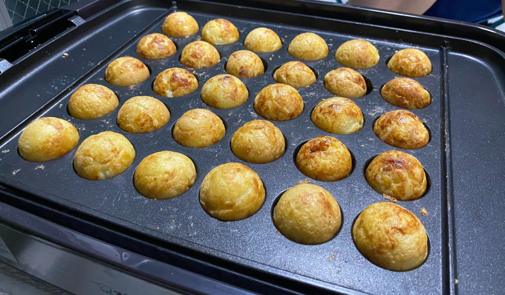
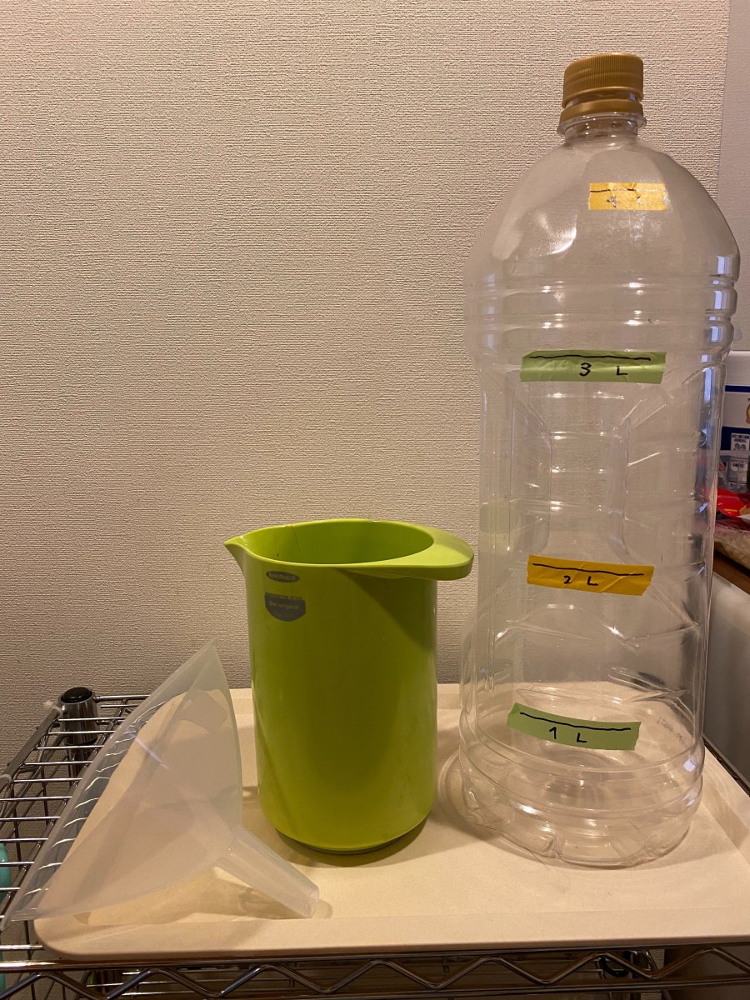
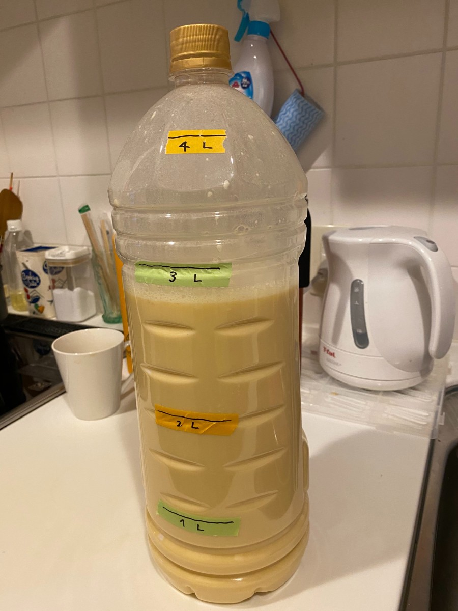
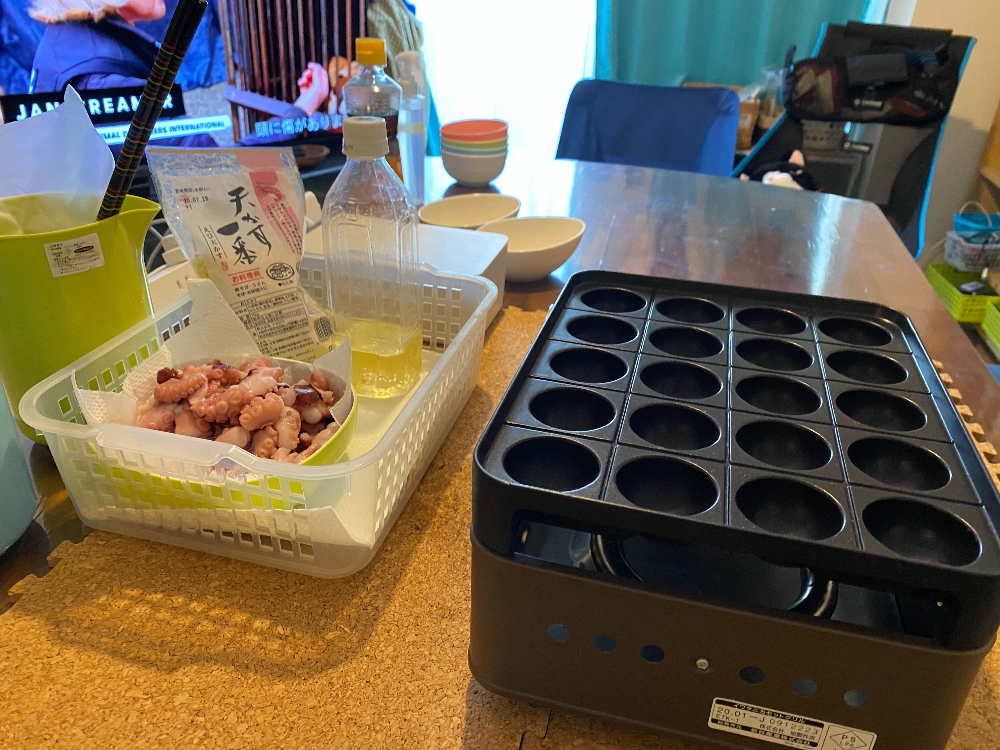
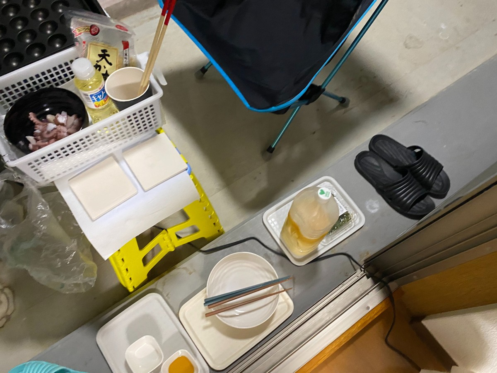

# さくらインターネット秘伝のおいしいたこ焼き

   

## 最初に

このレシピはフリーです。 
自由にブランチを切ったりして派生形をつくってもらってOKです。自由に作成してレポートを寄せてください。 
でもせっかくなので、「つくったよ」とか「アレンジしてみたよ」など、ご連絡していただけると当社のメンバーはとても喜びます。 
改善の提案などは、プルリクエストや、issue等でお知らせください。

このページでは、基本的に「大人数でのタコパ」を想定した 大規模なタコパを想定した道具・器材を紹介しています。

ごく少人数・一般家庭・ファミリースタイルで行う場合は「[参考：少人数でたこ焼きを作るときの道具について](#参考少人数でたこ焼きを作るときの道具について)」で道具を簡略化したものを紹介しています。参考にしてください。

1. [さくらインターネット秘伝のおいしいたこ焼き](#さくらインターネット秘伝のおいしいたこ焼き)
1. [材料・道具の準備](#材料道具の準備)
    1. [食材の準備](#食材の準備)
        1. [たこ焼き生地の材料](#たこ焼き生地の材料)
        1. [調理・焼きに必要な材料](#調理焼きに必要な材料)
        1. [つけだれの材料](#つけだれの材料)
    1. [道具・消耗品の準備](#道具消耗品の準備)
        1. [環境・設備のための道具](#環境設備のための道具)
        1. [生地を作る・焼くための道具](#生地を作る焼くための道具)
        1. [手元に用意しておくと便利な道具](#手元に用意しておくと便利な道具)
            1. [参考：少人数でたこ焼きを作るときの道具について](#参考少人数でたこ焼きを作るときの道具について)
        1. [焼くための道具](#焼くための道具)
        1. [食べるための道具](#食べるための道具)
1. [おいしいたこ焼きの作り方](#おいしいたこ焼きの作り方)
    1. [生地を作る・下ごしらえする](#生地を作る下ごしらえする)
    1. [場所の設営](#場所の設営)
    1. [たこ焼きを焼く](#たこ焼きを焼く)
    1. [重要なポイント](#重要なポイント)
1. [メモ](#メモ)

# 材料・道具の準備

## 食材の準備

以下の材料を準備してください

### たこ焼き生地の材料

人数・年齢・性別・胃袋に応じた食材を用意してください。表は1人10個前後食べる計算です。

|          材料              | 20～30人(300個)| 10～15人(150個)| 5～8人(100個)| 2～3人(50個) | 1〜2人(25個) |
| -------------------------- | -------------- | -------------- | ------------ | ------------ | ------------ |
|  **a. 水**                 |  6000g         | 3000g          | 2000g        | 1000g        | 500g |
|  **a. 薄力粉**             |  1500g         | 750g           | 500g         | 250g         | 125g   |
|  **a. 粉末だし**           |  120g          | 60g            | 40g          | 20g          | 10g  |
|  **a. 卵**                 |  20個          | 10個           | 7個          | 3-4個          | 2個 |
|  **b. ベーキングパウダー** |  40g           | 20g            | 14g          | 6〜4g           | 4〜3g  |

- 「粉末だし」は、なんでもOK。お店で手に入りやすいものを用意してください。

### 調理・焼きに必要な材料

|          材料         | 20～30人(300個)| 10～15人(150個)| 5～8人(100個)| 2～3人(50個) | 1〜2人(25個) |
| --------------------- | -------------- | -------------- | ------------ | ------------ |  ------------ |
|  **サラダ油**         |  適量          | 適量           | 適量         | 適量         | 適量         |
|  **天かす(あげ玉)**   |  250g 程度     | 180～200g 程度      | 80～100g 程度    | 40～50g 程度     | 20～25g |
|  **タコ**             |  1000g         | 500g           | 250g         | 125g         | 60g |

- 「カット済 冷凍タコ」が便利です。ネットで購入できます。なければ業務スーパーなどに売っている「冷凍たこぶつ」も使えます。
- 解凍したタコは、焼くまでに水分を十分に取り除いておいてください。水分があると、焼く時に滲み出てきて焼きにくくなることがあります。
- タコのカットサイズは「たこ焼き器」の焼き玉の大きさによります。普通サイズの場合は2-3g 程度、大玉であれば3-4gくらいが良いかもしれません。焼き玉のサイズに対してすれすれだったり大きいと、焼きむらや玉の形が乱れやすくなり、焼くのが難しくなります。小さくても2個ずつ入れるという技がありますので安心して下さい。
- タコが食べれない人がいる場合は、「イカ」「エビ」「チーズ」「ウィンナー」「スパム」「もち」「燻製ホタテ」など入れてみるとよいでしょう。検索すると結構意外な食材を入れている人がいます。

### つけだれの材料

|  つけだれ                               |  用意するもの                       |
| --------------------------------------- | ----------------------------------- |
|  **さくらイチオシ！「ねぎごま油塩」**   |  きざみネギ＋ごま油 ＋ 塩 or 鶏がら or 味しお |
|  **おすすめ！ 出汁のきいた「素焼き」**  |  なし                               |
|  意外とうまい「醤油」や「塩」           |  醤油＋マヨネーズ、塩のみ           |
|  定番！みんな大好き 「ソース」          |  ソース ＋ マヨネーズ ＋ 青のり     |

- 生地材料見てわかる通り、たこ焼きにはしっかり出汁の味が付いています。つけだれがなくても十分楽しめます。
- 肉のハナマサなどに「濃い口ごま油」が売ってます。ごま油 たれを作るときはオススメ。

## 道具・消耗品の準備

### 環境・設備のための道具

焼き場の掃除や撤収を楽にするための工夫です。任意で用意しましょう。

|  器具                            |  用意するもの                   |
| -------------------------------- | ------------------------------- |
|  ・**使い捨てテーブルクロス** ・**新聞紙** ・**ブルーシート**   | 焼き台の下には使い捨てのシートを引いておくのが**絶対よい**です。   どんなに気を付けていても生地や油がはねます。  大規模にやる場合は、焼き場の床にもシートを引いておくことをおすすめします。|
|  ・**養生テープ**                  | |
|  ・**たこ焼きポスター**            | 焼き場にたこ焼きのチラシを張っておくと雰囲気が出るかも。   [たこ焼きチラシ](/etc/) |

### 生地を作る・焼くための道具

生地を作るための道具です。大人数を想定した器材です。
小規模に行うときの器材提案を用意しています「[参考：少人数でたこ焼きを作るときの道具について](#参考少人数でたこ焼きを作るときの道具について)」を参照してください。

※以下の器材は、大人数を想定しています。小規模で行うときは加減してください;;

|  器具                              |  用意するもの                   |
| ---------------------------------- | ------------------------------- |
|  ・**計量カップ** ・**500ml～１Ｌ**        | 大きいほうが楽。|
|  ・**はかり** ・**キッチンスケール**      | 必要なら、計量スプーンも。|
|  ・**バケツ  またはそれに準ずるもの** | 生地の水 x2～2.5くらいの容量が良い。  水6Lの場合は材料を入れると12Lくらいになります。 この場合、攪拌する余白を考えて〜15L用がおススメ |
|  ・**泡だて器** ・**電動ハンドミキサー**  | バケツの底に粉がたまるので、しっかり混ぜる。  ハンドミキサーは持っていればスタートの攪拌はかなり楽できます。|
|  ・**さいばしなど**  | バケツの端っこに溜まってしまった粉を書き出すためにつかいます。 |

### 手元に用意しておくと便利な道具

|  器具                    |  用意するもの                   
| ------------------------ | ------------------------------- |
|  ・**クッキングペーパー** ・**ウェットティッシュ類**  | |
|  ・**使い捨て手袋**        | 素手調理が気になる場合は、手袋をして下ごしらえする。  タコを扱うときはあるととても楽です(手が臭くならない) |
|  ・**ハンドベル** (new!)     | パン屋さんなどでよくみかける焼き上がりを知らせるハンドベル。 会社など大人数でタコパするときは超おすすめ。 焼き上がりのタイミングを逃さないので食べる人が幸せになります。 100円均一に売ってます。 |

#### 参考：少人数でたこ焼きを作るときの道具について

- **生地の水２Ｌ以下のファミリータコパを開催する場合** ご家庭に調理用「バケツ」とか「ひしゃく」とか、道具を用意するのがきついので、写真のような 大きなペットボトルを用意し 生地の材料を入れて そのまま攪拌するのがおススメです。
（写真はサントリー角４Lペットボトルに「水 2L / 5～8人(100個)」の生地を作っている様子）

-  
 

必要なものは、

- **「ペットボトル」：**
   生地の水に対して**2倍以上** のサイズ。水１Ｌだったら、２Ｌペットボトルを用意しよう。
- **「じょうご(漏斗)」 ：**
  口が大きく、角度が急で、材料がボトルにストレートに落ちる「粉物用の特急じょうご」タイプがよい。なければ、紙をまいたりして自作してもよい。100均にもあるよ。
- **「大容量計量カップ」：**
  500～1000ml程度の計量カップ。大きい方が楽だし、たこ焼き器に生地を入れる時にも使える。
- **「はかり」「キッチンスケール」**

この方式だと、事前に生地を作ってペットボトルのまま外へ持ち出せるので、アウトドアでやるときにも便利。
一番の難関が **空きボトルを用意する**こと。

---

### 焼くための道具

|  器具               |  用意するもの                   |
| ------------------- | ------------------------------- |
|   ・**たこ焼き器**     | ホットプレートでもいいんですが、最近おススメはこれ!!   **「 [Iwatani カセットガスたこ焼器 “炎たこII”](https://www.iwatani.co.jp/jpn/consumer/products/cg/grill/cb-etk-2/)) 」**。   ガスボンベ式。火力がホットプレートと比べ物にならないくらい強い 一気に焼きあがるので **最高に使いやすい**。   **電源の取り回しがいらない**のも意外とポイント高。 デメリットは**たこ焼きしか焼けない**点 ... |
|  ・**たこ焼きピック ・竹串**  | たこ焼き器の特性によってピックが溶たり、鉄板に傷がつくので注意。 竹串は傷もつかずオールマイティで使えるのでおすすめ。  新しく買うのであればちょっと長めのものを選ぶとよい。|
|  ・**油引き**            | 「キッチンペーパー＋さいばしぬりぬり」 でも代用可能。  油引きは相性が悪いととっても使いづらい。 |
|  ・**キッチンペーパー** ・**ウェットティッシュ** など | 手の届く範囲に置いておこう。 |
|  ・**さいばし** ・**割りばし**          | |
|  ・**ひしゃく** ・**お玉**    | たこ焼き器に生地を流す前の攪拌、たこ焼き機に流し込むために使う。  注ぎ込む口があるとこぼれずに注ぎやすい。  バケツでやる場合は柄が長いものが使いやすい。|

### 食べるための道具

以下の道具はあくまでも一案です。タコパの規模などに合わせてで必要なものを用意しましょう。
大人数だと使い捨てでそろえるのがよいですね！

- **つま楊枝や割りばし** → 人数分
- **取り皿** → 人数分。平皿より、ちょっと小ぶりのボウル型のお皿が使いやすい
- **パーティプレート** → あると便利。焼き上がりをプール出来る大きなお皿
- **ボウル皿(調味料・つけだれ用)** → あると便利。共用NGの場合は、なくてOK
- **新聞紙と養生テープ** ※焼き場に事前に敷いておくとよいです
- **お手拭き用のウェットティッシュ** 
- **ごみ袋** 

# おいしいたこ焼きの作り方

## 生地を作る・下ごしらえする

0. 冷凍タコを使う場合は、生地を作る前にタコを流水解凍しておく。   

1. バケツに 「[たこ焼き 生地 (a)](#たこ焼き生地の材料)」をいれてよく混ぜる。 だまになったりしないように注意。(ほとんどの場合底にたまるので菜箸とかで救い上げる)
2. よく混ぜて、1時間程度 休ませます。可能であれば冷蔵庫に入れておきます。
3. 焼くちょっと前くらいに「[たこ焼き 生地 (b)](#たこ焼き生地の材料)」を入れて静かにかきまぜる。 その後、30分～1時間ほど生地を休ませる。
4. 中に入れる具材の下ごしらえをする。 タコやほかに入れるものをたこ焼きサイズに切る。 

## 場所の設営

生地を休ませてる間に場所を設営する。下ごしらえと並列で作業できると◎。 
（大人数タコパの設営プランなので、少人数で行う場合はある程度Skipできると思います）

1. たこ焼きを焼く場所を確保する。電源をとる場合は、焼きはじめで ブレーカーが落ちないように事前に気を付ける。 （途中でブレーカーが落ちると、バブルスライム状のたこ焼きになる可能性が高いです）
1. たこ焼き器を置くテーブルの足元の床に、ブルーシートや新聞紙をしいて 養生テープで固定する。
1. たこ焼き器を置くテーブルに、テーブルクロスか新聞紙・使い捨てシートなどを敷いて養生テープで固定する
1. テーブルの位置が決まったら電源タップや延長コードをとりまわして、たこ焼き器周辺に固定する。人が躓かないよう配線する。
1. たこ焼き器を設置する。手を伸ばして届くところにたこ焼き生地・タコ・天かす・ブルーシートが置けるよう、工夫する。     

## たこ焼きを焼く

※基本的にホットプレートでのたこ焼きを想定しています。

1. 初回は、たこ焼き器の鉄板を高温で温め、油をかなり多めに塗っておく。 羽の部分を含めまんべんなく油が塗られており、底に油が少したまっているくらい。
   煙が上がるくらい熱してなじませる。 特に初回は生地が鉄板に引っ付きやすいため、かなり多めに油を使うほうがよい。

2. たこ焼き生地を入れる前に毎回 **しっかり生地を攪拌する** 。 (タコの生地は毎回底に生地が沈殿します！) 

3. たこ焼き器へ生地を流し込む。丸い部分からあふれさせて 「羽」の部分まできれいに流す (※これはたこ焼き器の特性にも左右されるので、その都度微調整する)

4. 「タコ」を入れる → すぐに ぱらぱらと 「天かす（あげ玉）」をまぶす。 天かすは余計な水分を吸い、油を出すので カリっとした仕上がりと、きれいなたこ焼きが作りやすくなります。

5. 「羽」が焼けてきたら、ピックでたこ焼き器のタコのくぼみの間の羽を切り、焼け始めた羽をペロリとめくって玉の中へ巻き込むように入れておきます。
   - この段階ではまだバブルスライムみたいな見た目ですがきにしなくて大丈夫です。
   - 穴の中に巻き込んだ羽部分は たこ焼き玉の一部となります。 なので、羽の量を偏りなく玉にいれていくと ちょうどよい真円が出来上がります。

6. たこ焼き玉の焼きの面がパリッとなっていたら、くるりとひっくり返す。（慣れなので、文字にするのは難しい）  きれいに丸く焼いていくために どこの面が焼かれているのか意識しながら回しましょう。

7. 回しながらじっくり焼き、真円に近づけていきます。焼き面が焼きあがる前に生地にさわると ゲル状のままうまく焼けなくなってしまいます。 たこ焼きだからとついつい触ってしまいますが、 我慢してください。 **まるい形が安定するまでは、過剰に触らないように！**

8. たこ焼き全体が **「真円でかりっとキツネ色」「表面をたたいて コツコツ固くなった」** ものから完成。  引き上げて、いただきます！

9. 個人的には、表面が360度カチカチになったら完成。
   串でこんこん、と玉をたたいて 確認しましょう。やけたかな？とおもってから意外とカチカチになるまで、時間がかかります。 

## 重要なポイント

* 生地
  * ベーキングパウダーは 生地の作成過程のなかで、 **最後** または **焼きはじめの十数分前くらい**に入れる。 
    生地作りの時に、最初に入れると攪拌の時に泡立ってしまってあんまり意味がなくなる。
  * 生地は作ってからすこし休めておくほうが仕上がりがいいらしい。未検証。
* 焼き
  * 焼く前に、**その都度 生地を攪拌する**。
  * 初めの一回目や、たこ焼き器がおろしたての時は、油がしみていないので かなりの確率で失敗しますが、心を乱さないようにする。
  * 火の調節がうまくいかないと失敗します。かりっと作るためには強めの火力が必要。
  * たこ焼きは、**ついつい触りたくなります**が、**表面が焼けてないうちにつんつん触りすぎると** 失敗の確率が上昇します。
     たこ焼きで一番重要なことは **我慢**。
  * ホットプレートやコンロの特性によりますが、基本的に 火のあたりづらい位置のたこ焼きは**焼き上がりが遅い** です。 焼きながら 特性をつかみ、工夫してください。 
    表面が一とおり焼きあがって形が完成されてきたら、焼きが早いものと位置を入れ替えるとよいでしょう。

# メモ

`/etc` にたこ焼きのれん用の画像を入れておきました
